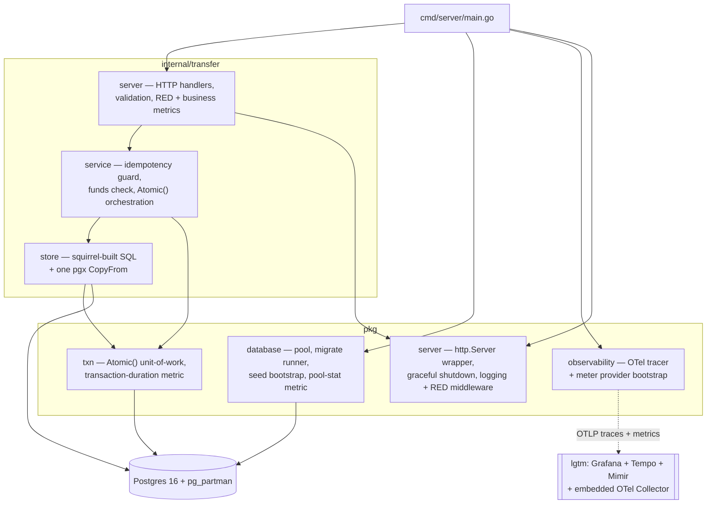

# Architecture

Component/dependency view. Mermaid renders natively on GitHub — no extra tooling
needed to view this.

Handler → service → store: a standard layered split — handler owns transport
(decode, validate, status codes), service owns business rules (idempotency, funds
check), store owns SQL. Each layer only calls the one below it.

See also:
- [Bulk transfer request flow](./sequence-submit-bulk-transfer.md) — the actual
  concurrency/idempotency logic, step by step.
- [Schema](./schema.md) — tables, keys, and the partitioning boundary.
