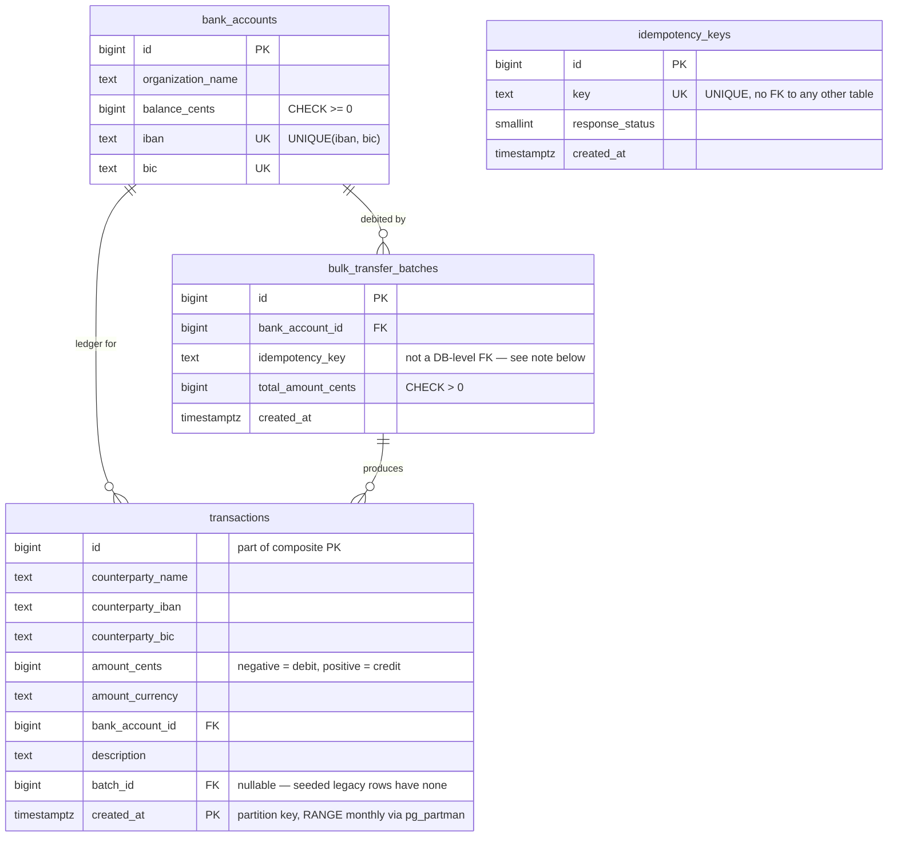

# Schema

Notes that don't fit in a diagram:

- **`idempotency_keys` has no foreign key to anything.** It doesn't know the
  bulk-transfer domain exists — see the
  [README](../README.md#schema-indexing-and-partitioning) for why that's what
  makes it reusable, and why it's the one table that must *not* be partitioned by
  `created_at` even though it has the column.
- **`transactions.batch_id` isn't tied to `bulk_transfer_batches.idempotency_key`
  by a database constraint** — `bulk_transfer_batches` stores its own copy of the
  idempotency key value (indexed, for support/debug lookups: "which batch did
  this client-supplied key produce"), but the two tables are otherwise
  independent by design.
- **`transactions`' primary key is `(id, created_at)`, not just `id`** — a
  consequence of `PARTITION BY RANGE (created_at)`: Postgres requires the
  partition key in every unique constraint on a partitioned table.
- Every relationship and lookup here is covered by an index — see the table in
  the [README](../README.md#schema-indexing-and-partitioning), verified against
  the real Postgres catalog by
  [`TestMigrations_PartitioningAndIndexes`](../internal/transfer/store/store_integration_test.go).
