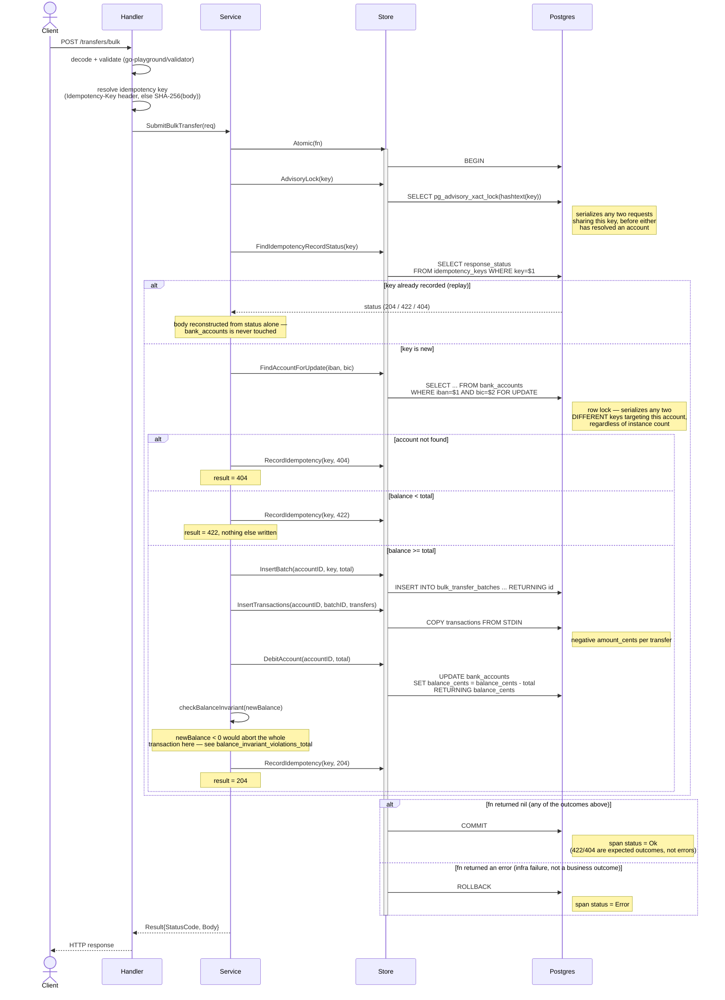

# Bulk transfer request flow

This is the actual logic behind
[`SubmitBulkTransfer`](../internal/transfer/service/transfer.go) — the part of
this exercise that matters most. Every step below runs inside one Postgres
transaction; see the [README](../README.md#concurrency-atomicity-and-idempotency)
for the reasoning behind each lock.

The two `alt` blocks that matter for correctness under concurrency:

- **Same idempotency key, concurrent** → both requests hit the advisory lock
  first; the second waits for the first to commit, then sees the recorded
  status in `FindIdempotencyRecordStatus` and replays it — the batch is applied
  exactly once. Proven by
  [`TestSubmitBulkTransfer_ConcurrentDuplicateRequestsShareOneOutcome`](../internal/transfer/service/service_integration_test.go).
- **Different idempotency keys, same account, concurrent** → both pass the
  advisory lock (different keys, no conflict there), then serialize on the
  `FOR UPDATE` row lock instead; each sees the balance as it stood after the
  previous one committed. Proven by
  [`TestSubmitBulkTransfer_ConcurrentRequestsNeverOverdraw`](../internal/transfer/service/service_integration_test.go).
